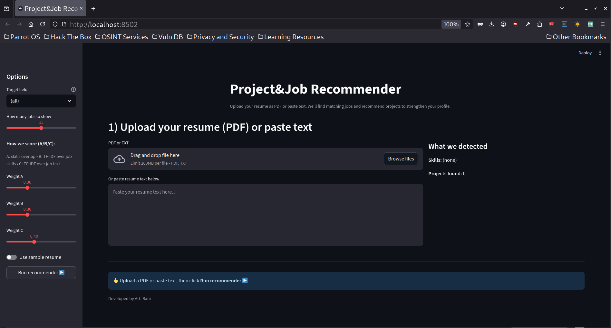
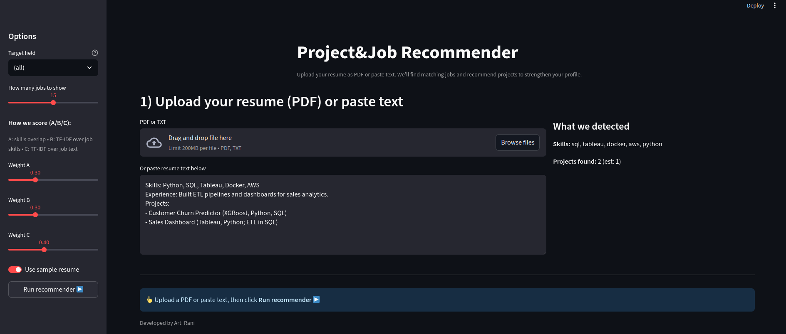
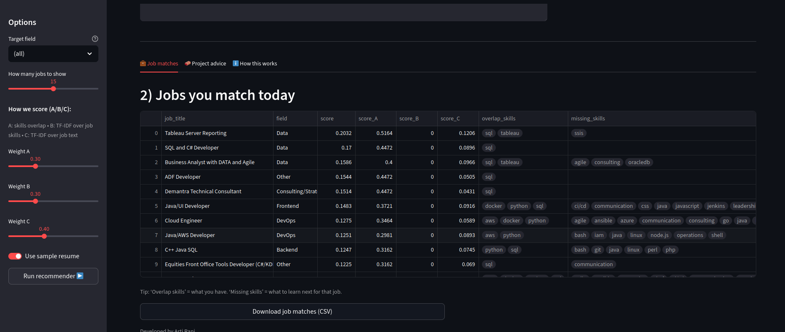
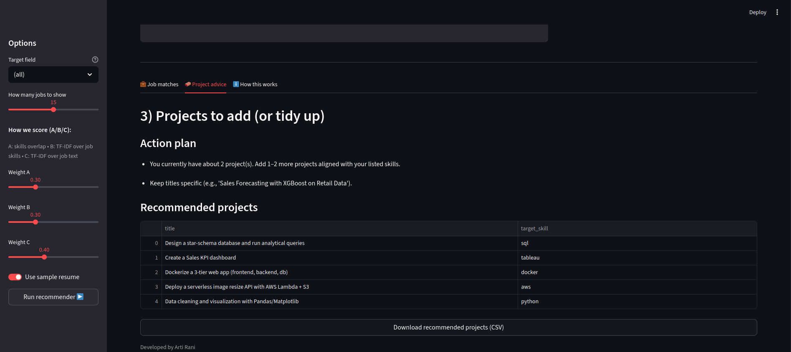
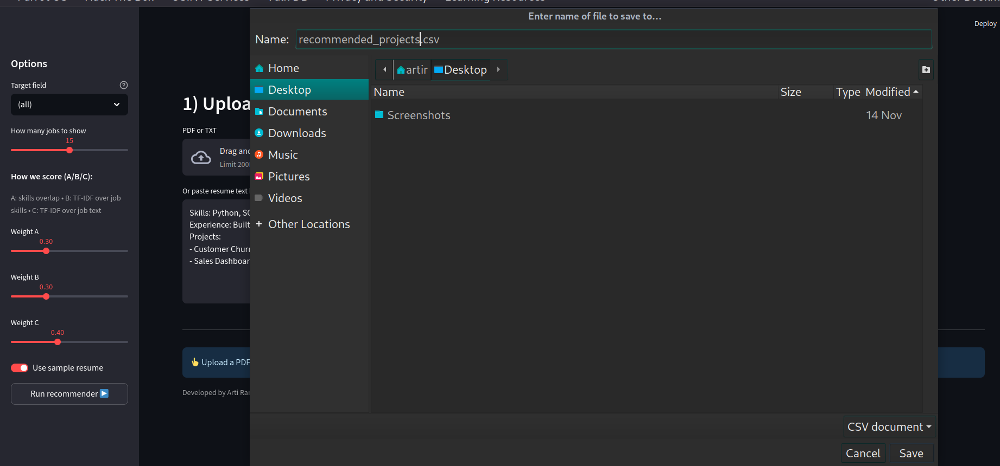
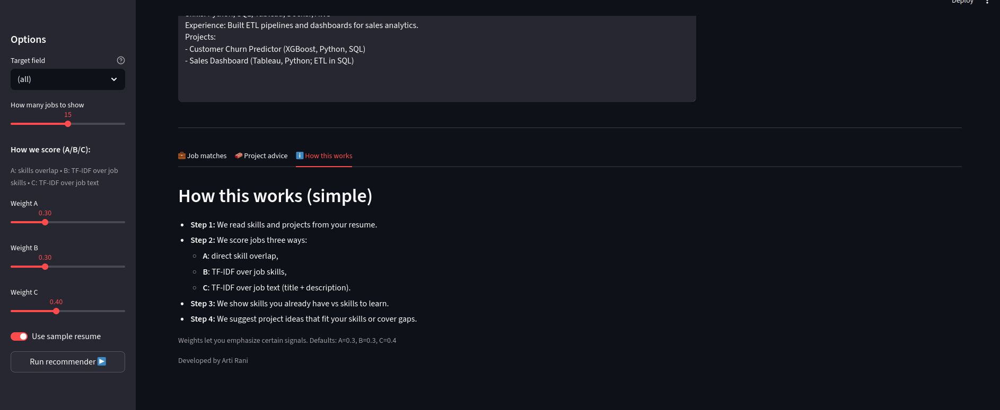

# 🚀 Job & Resume Recommender System

A smart career assistant that matches **your resume** with **job datasets** to suggest:
- ✅ Relevant job roles you are a good fit for.  
- ✅ Missing skills & suitable projects to improve your chances.  

Built with **Python**, **pandas**, and **NLP-based parsing**.  

---

## 📌 Features
- **Resume Parsing** → extracts skills & projects automatically.  
- **Job Role Matching** → compares your skills to requirements in job datasets.  
- **Recommendations**:
  - Alternative job roles where your skills overlap better.  
  - Project ideas to add (if resume has <2 projects or missing required skills).  
- **Extensible Taxonomy** → `skills_taxonomy.json` for skill mappings & aliases.  
- **Datasets Supported**:
  - IT Job Dataset (Sri Lanka)  
  - Dice.com Jobs (US)  
  - Morocco Jobs Sample  

---


## 📂 Project Structure
```markdown
AI-ML_Projects/
└── Capstone-Job-Recommender/
├── apps/
│ ├── app.py
│ └── logo.png
│
├── datasets/
│
├── final
│   └── jobs_skills
│       ├── jobs_unified_with_skills.csv
│       ├── jobs_unified_with_skills_FIXED.parquet
│       ├── jobs_unified_with_skills.parquet
│       ├── skills_extraction_audit.csv
│       └── vocab
│           ├── jobs_clean.parquet
│           ├── jobs_unified_with_skills_FIXED.parquet
│           ├── jobs_vectors.npz
│           ├── jobs_vectors.row_idx.npy
│           ├── jobs_vectors.rows.txt
│           └── skills_vocab.csv
├── prepared
│   ├── aliases.json
│   ├── dice_com_deduped.csv
│   ├── dice_com_duplicates.csv
│   ├── field_map.json
│   ├── jobs_unified.csv
│   ├── jobs_unified.parquet
│   ├── morocco_deduped.csv
│   ├── morocco_duplicates.csv
│   ├── project_ideas.json
│   ├── skills_taxonomy.json
│   ├── srilanka_deduped.csv
│   └── srilanka_duplicates.csv
├── processed
│ │ ├── field_role_map.json
│ └ └── jobs_merged_unified.csv
│ 
└── raw
│ │ ├── dice_com-job_us_sample.csv
│ │ ├── IT_Job_Dataset_SriLanka_20000 (1).csv
│ │ ├── morocco_jobs_sampled (5).csv
│ │ └── ods_format
│ │     ├── dice_com-job_us_sample.ods
│ │     ├── IT_Job_Dataset_SriLanka_20000 (1).ods
│       └── morocco_jobs_sampled (5).ods
├── src /
│ ├── api/
│ │   ├── check_paths.py
│ │   ├── main.py
│ │   └── __pycache__
│ │       ├── check_paths.cpython-311.pyc
│ │       └── main.cpython-311.pyc
│ ├── diagnostic_cell.ipynb
│ ├── __init__.py
│ ├── matcher.py
│ ├── notes.md
│ ├── paths.py
│ ├── __pycache__ /
│ │   ├── __init__.cpython-311.pyc
│ │   ├── matcher.cpython-311.pyc
│ │   ├── paths.cpython-311.pyc
│ │   └── step7_gap_projects.cpython-311.pyc
│ ├── rebuild_jobs_vectors.py
│ └── step7_gap_projects.py
│
├── notebooks/
│ ├── basic_EDA
│ │ ├── EDA_dice_com-job_us_sample.ipynb
│ │ ├── EDA_IT_Job_Dataset_SriLanka_20000.ipynb
│ │ ├── EDA_merged_data.ipynb
│ │ └── EDA_morocco_jobs.ipynb
│ │
│ ├── 01_setup.ipynb
│ └── 02_matcher&recommender.ipynb
│
├── ss/
│ ├── InitialScreen.png
│ ├── Sample.png
│ ├── JobMatch.png
│ ├── ProjectAdvice.png
│ ├── DownloadSuggestions.png
│ └── Working.png
│ 
├── .gitignore
├── README.md
├── requirements.txt
├── To-Do.md
└── Useful_Commands.md

````

---

## ⚙️ Installation

1. Clone the repo:
   ```bash
   git clone https://github.com/your-username/job-resume-project.git
   cd job-resume-project
   ```

2. Create a virtual environment & install requirements:

   ```bash
   python -m venv venv
   source venv/bin/activate   # Linux / Mac
   venv\Scripts\activate      # Windows
   
   pip install -r requirements.txt
   ```

---

## ▶️ Usage

### Run in Jupyter

1. Open `notebooks/01_setup.ipynb` to load datasets.
2. Process & try recommendations in `02_matcher&recommender.ipynb`.

### Run demo app

```bash
streamlit run app.py
```

---

## 📊 Example Flow

* Input Resume:

  ```
  Skills: Python, Pandas
  Projects: 1 (Movie Recommender)
  Target Job: Data Scientist
  ```
* Output:

  * Suggests Data Analyst role (higher skill overlap).
  * Missing skills: SQL, Deep Learning.
  * Project Ideas:

    * SQL-based ETL Pipeline
    * Image Classifier with Deep Learning

---

## Frontend Screenshots 













## 🛠️ Tech Stack

* **Python** (pandas, numpy, scikit-learn)
* **NLP** (regex, spaCy for parsing)
* **Recommender Systems** (cosine similarity)
* **Visualization** (matplotlib, seaborn)
* **Streamlit** (for demo app)

---

## 📌 Next Steps

* Improve resume parser with ML-based NER.
* Add more curated project ideas.
* Host the project  (using React for frontend & GCP for backend).

---

## 👨‍💻 Author

Built by *Arti Rani* for project submission (Sept 2025).
